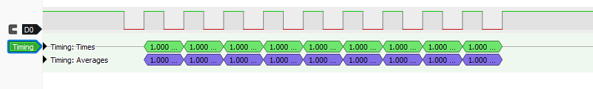
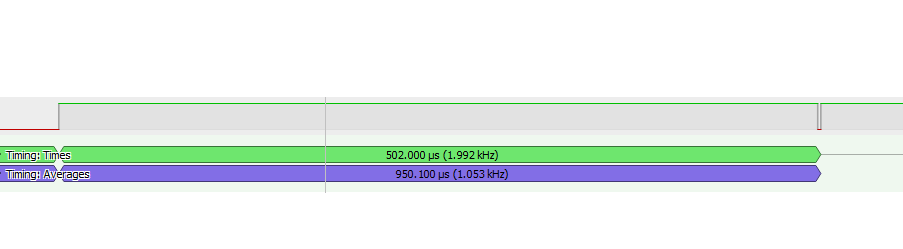
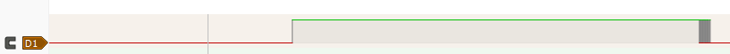
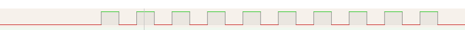

# STEP line idle level

Bench observations made while validating the free-running compare backend
(TIM4 CH1 in output-compare toggle mode) on the STM32F407 Discovery
example, `examples/stm32f407_discovery_fixed_count`.

## Summary

The STEP pin is only driven while the timer channel is enabled. Before the
first movement, between movements and after every stop, nothing drives it,
so its level depends entirely on what holds the line:

- **During reset and early boot** (until `MX_TIM4_Init()` runs) the pin is a
  floating input. On this example that window lasts hundreds of
  milliseconds. **Only an external pull-down covers it.**
- **Between movements** (channel disabled after `channel_stop`) the pin is in
  alternate-function mode with its output buffer off. **The internal
  pull-down covers it**, and so does an external one.

A STEP line has to idle low with an external pull-down. The internal
pull-down should also stay enabled. Without the external resistor, a reset
can produce an edge on STEP, which a stepper driver counts as a step.

## Setup

| Item | Value |
|---|---|
| Board | STM32F407G-DISC1 |
| STEP pin | PD12 = TIM4_CH1 (AF2), also wired to LED LD4 through 510 Ω to GND |
| Timer | TIM4, 84 MHz timer clock, prescaler 83 → 1 MHz tick, ARR at counter maximum |
| Demo movement | `pulse_generator_start_fixed_count(&pg, PULSE_GENERATOR_BACKEND_TIMER, 1000, 10)`: 1 kHz, 10 pulses |
| Instrument | Logic analyzer, PD12 → analyzer input, common GND |

## Observations

### 1. Faulty analyzer channel (D0)

With the probe on channel D0, the signal looked inverted:
- The line was high before the burst.
- The first edge was a falling one.
- The line ended high.

The timing itself was correct (1.000 ms periods).



At a higher sample rate, the end of the burst showed the last real low level for only a couple of microseconds. After that, the line read high again.



D0 turned out to be defective. It reads high unless the input is actively
driven low:
- It still read high with a 10 kΩ resistor from the probe to GND.
- It read low only when tied straight to GND.

Moving the probe to channel D1 removed the problem.

The fault mixed with the real behaviour of the pin. While the timer drove PD12, D0 reproduced the signal correctly. Whenever PD12 was not driven (before the burst, and right after `channel_stop()` disabled the channel), D0 reported high. That is what made the burst look inverted.

The LED was a useful cross-check. LD4 stayed off at idle, which is impossible if PD12 were really at 3.3 V: the LED would draw about 2 mA through 510 Ω.

### 2. Channel D1, internal pull-down only

With the internal pull-down enabled (`GPIO_PULLDOWN` in `HAL_TIM_MspPostInit()`), the capture showed three phases:
- The line started low.
- After a reset it went high for a long time.
- The burst followed (the dense block on the right).



### 3. Channel D1, external 10 kΩ pull-down

With an external 10 kΩ resistor from PD12 to GND:
- The line stays low at idle.
- The burst starts with a rising edge.
- Exactly 10 clean pulses follow.
- The line returns low.



## Pin state timeline

| Phase | PD12 mode | Pull | TIM4 CC1E | Who sets the level |
|---|---|---|---|---|
| Reset, `HAL_Init()`, `SystemClock_Config()` | Input (reset state) | None | 0 | Nothing: floating |
| `MX_GPIO_Init()` … `MX_USB_HOST_Init()` | Input (reset state) | None | 0 | Nothing: floating |
| `MX_TIM4_Init()` → `HAL_TIM_MspPostInit()` | Alternate function (AF2) | Pull-down | 0 | Pull-down only (~40 kΩ) |
| `channel_start()` → burst | Alternate function | Pull-down | 1 | TIM4 push-pull output |
| `channel_stop()` → idle | Alternate function | Pull-down | 0 | Pull-down only |

## Why the pin floats

On the general-purpose timers (TIM2–TIM5), clearing CCxE disables the OCx
output. The GPIO output buffer is then off, so neither the P-MOS nor the
N-MOS conducts. See the "Basic structure of a 5 V-tolerant I/O port bit"
figure in RM0090. With the buffer off, the only things holding the pin
are:

- the internal pull-up/pull-down, if enabled (weak, about 30–50 kΩ per the
  STM32F407 datasheet);
- whatever is connected externally.

The on-board LED does not define the level. Below its forward voltage
(roughly 1.8–2 V) it barely conducts, so a floating PD12 can sit at an
intermediate voltage without lighting it. A floating input has no defined
level: it depends on leakage, on the input stage of whatever is connected
(analyzer, driver) and on capacitive coupling. It can read as either level,
and it can change from one capture to the next.

## Why the long high pulse

`main.c` initialises the peripherals in the order CubeMX generated, and
`MX_TIM4_Init()` comes last:

```
HAL_Init();
SystemClock_Config();
MX_GPIO_Init();
MX_I2C1_Init();
MX_I2S3_Init();
MX_SPI1_Init();
MX_USB_HOST_Init();   /* USBH_Start() → USBH_LL_DriverVBUS() → HAL_Delay(200) */
MX_TIM4_Init();       /* HAL_TIM_MspPostInit(): PD12 becomes AF + pull-down */
```

`MX_USB_HOST_Init()` starts the USB host stack. Its `USBH_Start()` calls
`USBH_LL_DriverVBUS()` in `USB_HOST/Target/usbh_conf.c`, which waits
200 ms. The USB core reset and mode switch in `stm32f4xx_ll_usb.c` add
further `HAL_Delay()` calls. Until `MX_TIM4_Init()` runs, PD12 is still a
floating input, so the window lasts hundreds of milliseconds.

The capture in observation 2 reads as follows:

1. **Low.** The previous run had finished and left PD12 with its pull-down enabled.
2. **Rising edge.** Flashing reset the MCU. PD12 went back to its reset state (a floating input) and drifted high.
3. **Long high.** The boot sequence above was still running.
4. **Back to low.** `HAL_TIM_MspPostInit()` enabled the pull-down. This is invisible at this zoom level.
5. **Burst.** About 500 µs later, `channel_start()` enabled the channel and the first toggle produced the first rising edge.

With the external 10 kΩ resistor, the line is held low from power-up, independently of what the firmware is doing. Steps 2 and 3 no longer happen.

## Internal vs external pull-down

| | Reset → `MX_TIM4_Init()` | Between movements | Strength |
|---|---|---|---|
| Internal pull-down | Not active | Holds the line low | Weak, ~40 kΩ |
| External pull-down | Holds the line low | Holds the line low | Chosen by design, e.g. 10 kΩ |

The internal pull-down is still worth enabling:
- It keeps the line defined between movements on hardware that lacks the external resistor, such as this Discovery board.
- With an external resistor fitted, it is simply in parallel (about 8 kΩ combined) and does no harm.
- It cannot replace the external resistor, because it only exists once the firmware has configured the pin.

## Implications for a real stepper driver

A stepper driver counts a step on every active edge of STEP. The rising
edge produced while the pin floats after a reset would be a spurious step,
and a floating line can pick up noise and produce more. For any board that
drives a real motor:

- **Fit an external pull-down on every STEP line** (typically 10 kΩ). This
  is the only protection that works before the firmware runs.
- **Keep the internal pull-down enabled** on the STEP pin, as a second line
  of defence between movements.
- **Initialise the STEP GPIO early.** CubeMX lets you reorder the generated
  `MX_*_Init()` calls (Project Manager → Advanced Settings). This shortens
  the floating window but does not remove it: the pin still floats from
  reset until that call.
- **Keep the driver disabled while booting.** Most drivers have an enable
  input; on the TMC2209 it is ENN, which is active low. Pull ENN up
  externally so the driver ignores STEP until the firmware enables it.
- Check whether the driver has its own internal pull-down on STEP, and do
  not rely on it alone.

## Measurement lesson

Before trusting an analyzer channel, check it:
- tie it to GND and confirm it reads low;
- tie it to 3V3 and confirm it reads high;
- if possible, also check it through a pull resistor.

A channel that only fails when the input is weakly driven looks fine while the timer is driving the pin. It shows its fault exactly when the pin is not driven, which is the condition being investigated. Cross-check with an independent indicator when one is available (here, the on-board LED), or with a multimeter.

## References

- RM0090, STM32F405/415, STM32F407/417, STM32F427/437 and STM32F429/439
  reference manual: GPIO functional description (I/O port bit structure)
  and the general-purpose timer CCER register (CCxE output control).
- STM32F407xx datasheet: I/O static characteristics (weak pull-up/pull-down
  resistance).
- UM1472, STM32F4DISCOVERY user manual: schematic for LD4 on PD12.
